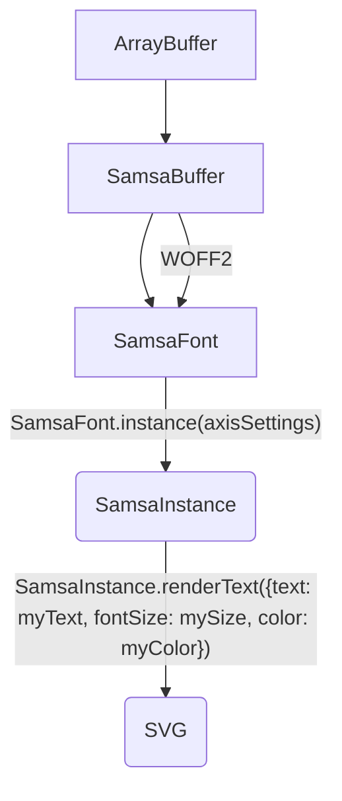

# samsa-core
Library for processing TrueType font files.

Features:

* variations
* avar1 and avar2
* COLRv0 and COLRv1
* SVG generation
* shaping:
  * GSUB (includes basic ligatures and Emoji)
  * GPOS (includes class pair kerning with exceptions)
  * Feature Variations
  * script and language selection

This repo is for Version 2 development. Version 1 is managed in the [Samsa GUI](https://github.com/Lorp/samsa) repo.

## How to use

Here is a high-level flowchart illustrating how Samsa loads a font file, creates an instance and renders text.



Here is sample code for Node.js that loads `filename` from disk, creates a SamsaFont object, creates a SamsaInstance object instance with variation axes set to certain locations, renders the string `hello, world!` as SVG, then saves the SVG to the file `render.svg`.

```javascript
const arrayBuffer = fs.readFileSync(filename);
const buffer = new SamsaBuffer(arrayBuffer);
const font = new SamsaFont(buffer);
const instance = font.instance({wght: 900, wdth: 200});
const svg = instance.renderText({text: "hello, world!", fontSize: 72 });
fs.writeFileSync("render.svg", svg);
```

In a browser, you obtain an ArrayBuffer and process it similarly.

```javascript
const buffer = new SamsaBuffer(arrayBuffer);
const font = new SamsaFont(buffer);
const instance = font.instance({wght: 900, wdth: 200});
const svg = instance.renderText({text: "hello, world!", fontSize: 72 });
document.getElementById("myDiv").innerHTML = svg;
```

If loading a font file from a remote URL, you’ll probably use `fetch()` then `response.arrayBuffer()` to obtain the ArrayBuffer. If a font file is dragged onto the browser, the ArrayBuffer is obtained by enumerating the `e.dataTransfer.items` array, where `e` is the drop event. For each `item` in the array (there may be multiple files), if its `kind` property is equal to `file`, set `file = item.getAsFile()` and the promise `file.arrayBuffer()` will yield the ArrayBuffer.

## In use

* [samsa-core v2 simple demo](https://codepen.io/lorp/pen/LYXgZdr) (CodePen)
* [RenderStack](https://lorp.github.io/renderstack/dist/) ([repo](https://github.com/Lorp/renderstack))
* [figma-colrv1](https://github.com/Lorp/figma-colrv1)
* [Samsa-GUI](https://lorp.github.io/samsa/src/samsa-gui.html) ([repo](https://github.com/Lorp/samsa), uses Version 1, upgrade planned)
